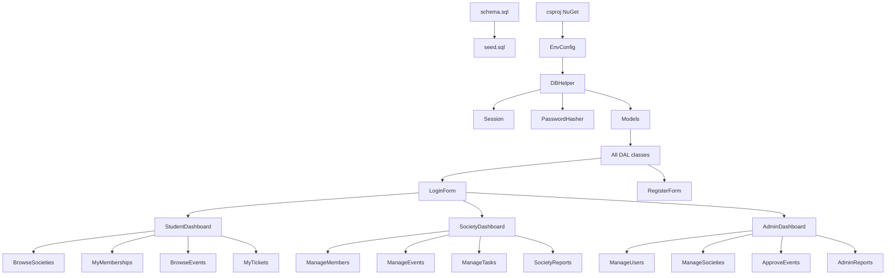

# Societies Management System -- Full Implementation Plan

---

## Reconciled Architecture

Both `requirements.md` and `plan.md` have been merged. Where they conflict, the chosen option applies:

- **Framework:** .NET 10 (keep current `SMM-PROJ.csproj`)
- **Data access:** DAL layer (forms never contain raw SQL)
- **Passwords:** BCrypt via `BCrypt.Net-Next`
- **Config:** `.env` file for connection string
- **Schema:** plan.md's enhanced schema (UNIQUE constraints, PasswordHash, TicketCode, ApprovedAt) + requirements.md's Announcements table

---

## Final Folder Structure

```
SMM-PROJ/
├── .env                              # Connection string (git-ignored)
├── .env.example                      # Template for other devs
├── Database/
│   ├── schema.sql                    # Full DDL
│   └── seed.sql                      # Sample data
├── Config/
│   └── EnvConfig.cs                  # Reads .env at startup
├── DAL/
│   ├── DBHelper.cs                   # GetConnection, ExecuteNonQuery, ExecuteReader, ExecuteScalar
│   ├── UserDAL.cs                    # Login, Register, GetAll, Delete, Search
│   ├── SocietyDAL.cs                 # CRUD, GetByHead, GetActive
│   ├── MembershipDAL.cs              # Apply, Approve, Reject, GetByUser, GetBySociety
│   ├── EventDAL.cs                   # CRUD, GetPending, GetApproved, Register
│   ├── TaskDAL.cs                    # Create, MarkComplete, GetBySociety
│   └── AnnouncementDAL.cs            # Create, GetBySociety
├── Models/
│   ├── User.cs
│   ├── Society.cs
│   ├── Event.cs
│   ├── Membership.cs
│   ├── TaskItem.cs                   # Named TaskItem to avoid System.Threading.Tasks collision
│   └── Announcement.cs
├── Helpers/
│   ├── Session.cs                    # Static class holding current user state
│   └── PasswordHasher.cs            # BCrypt wrapper (Hash + Verify)
├── Forms/
│   ├── Auth/
│   │   ├── LoginForm.cs/.Designer.cs/.resx
│   │   └── RegisterForm.cs/.Designer.cs/.resx
│   ├── Student/
│   │   ├── StudentDashboard.cs/.Designer.cs/.resx
│   │   ├── BrowseSocieties.cs/.Designer.cs/.resx
│   │   ├── MyMemberships.cs/.Designer.cs/.resx
│   │   ├── BrowseEvents.cs/.Designer.cs/.resx
│   │   └── MyTickets.cs/.Designer.cs/.resx
│   ├── Society/
│   │   ├── SocietyDashboard.cs/.Designer.cs/.resx
│   │   ├── ManageMembers.cs/.Designer.cs/.resx
│   │   ├── ManageEvents.cs/.Designer.cs/.resx
│   │   ├── ManageTasks.cs/.Designer.cs/.resx
│   │   └── SocietyReports.cs/.Designer.cs/.resx
│   └── Admin/
│       ├── AdminDashboard.cs/.Designer.cs/.resx
│       ├── ManageUsers.cs/.Designer.cs/.resx
│       ├── ManageSocieties.cs/.Designer.cs/.resx
│       ├── ApproveEvents.cs/.Designer.cs/.resx
│       └── AdminReports.cs/.Designer.cs/.resx
└── Program.cs                        # Entry point -> LoginForm
```

---

## Phase 1 -- Database Scripts

### 1A: `Database/schema.sql`

Merged schema from both docs. Key additions over requirements.md:
- `PasswordHash NVARCHAR(256)` instead of `Password`
- `UNIQUE (UserID, SocietyID)` on Memberships
- `UNIQUE (EventID, UserID)` on EventRegistrations
- `TicketCode NVARCHAR(50)` on EventRegistrations
- `ApprovedAt DATETIME` on Memberships
- `AssignedBy INT FK` on Tasks
- Announcements table (from requirements.md)

All tables: `Users`, `Societies`, `Memberships`, `Events`, `EventRegistrations`, `Tasks`, `Announcements`.

### 1B: `Database/seed.sql`

Sample data: 1 Admin, 2 SocietyHeads, 3 Students, 3 Societies (2 Active, 1 Pending), 2 Events, memberships, and tasks. Passwords pre-hashed with BCrypt.

---

## Phase 2 -- Project Foundation

### 2A: Update `SMM-PROJ.csproj`

Add NuGet packages:
- `Microsoft.Data.SqlClient` -- SQL Server driver for .NET 10
- `BCrypt.Net-Next` -- Password hashing
- `DotNetEnv` -- `.env` file reader

### 2B: `.env` / `.env.example`

```
DB_SERVER=.\SQLEXPRESS
DB_NAME=SocietiesManagementSystem
DB_INTEGRATED_SECURITY=True
```

### 2C: `Config/EnvConfig.cs`

Static class that calls `DotNetEnv.Env.Load()` once at startup and exposes `ConnectionString` built from the env vars.

### 2D: `DAL/DBHelper.cs`

Singleton-style static helper. Reads connection string from `EnvConfig.ConnectionString`. Methods:
- `GetConnection()` -- returns open `SqlConnection`
- `ExecuteNonQuery(string query, params SqlParameter[] parameters)` -- returns rows affected
- `ExecuteReader(string query, params SqlParameter[] parameters)` -- returns `DataTable`
- `ExecuteScalar(string query, params SqlParameter[] parameters)` -- returns `object`

All methods use parameterized queries. All wrap in try/catch.

### 2E: `Helpers/Session.cs`

```csharp
public static class Session {
    public static int UserID { get; set; }
    public static string FullName { get; set; }
    public static string Email { get; set; }
    public static string Role { get; set; }
    public static int? SocietyID { get; set; }
    public static void Clear() { ... }
}
```

### 2F: `Helpers/PasswordHasher.cs`

Two static methods:
- `Hash(string password)` -- returns BCrypt hash
- `Verify(string password, string hash)` -- returns bool

### 2G: All 6 Model classes

Plain C# POCOs with properties matching table columns. No logic, just data holders.

### 2H: `Program.cs`

Update entry point: load `.env`, then `Application.Run(new LoginForm())`.

---

## Phase 3 -- Authentication Forms

### 3A: `Forms/Auth/LoginForm.cs`

- **UI:** Title label, Email TextBox, Password TextBox (masked), Login button, "Register" LinkLabel
- **DAL call:** `UserDAL.GetByEmail(email)` returns User model
- **Logic:** Verify password with `PasswordHasher.Verify()`, populate `Session`, open role-based dashboard (`StudentDashboard` / `SocietyDashboard` / `AdminDashboard`), hide LoginForm
- **Navigation:** `dashboard.Show(); this.Hide();`

### 3B: `Forms/Auth/RegisterForm.cs`

- **UI:** FullName, Email, Password, Confirm Password, Role ComboBox (Student / SocietyHead), Register button, "Back to Login" LinkLabel
- **DAL calls:** `UserDAL.EmailExists(email)`, `UserDAL.Register(user)`
- **Logic:** Validate fields, hash password, insert, redirect to LoginForm

### 3C: `DAL/UserDAL.cs`

Methods needed for this phase:
- `GetByEmail(string email)` -- returns `User` or null
- `EmailExists(string email)` -- returns bool
- `Register(User user)` -- inserts and returns success bool
- `GetAll()` -- for Admin later
- `Search(string query)` -- for Admin later
- `Delete(int userId)` -- for Admin later

---

## Phase 4 -- Student Module

### 4A: `Forms/Student/StudentDashboard.cs`

- **UI:** Welcome label ("Welcome, {FullName}"), side panel with 4 nav buttons (Browse Societies, My Memberships, Browse Events, My Tickets), Logout button
- **Logic:** Each button opens the corresponding form via `form.Show(); this.Hide();`. Logout clears Session, shows LoginForm.

### 4B: `Forms/Student/BrowseSocieties.cs` + `DAL/SocietyDAL.cs`

- **UI:** DataGridView (ReadOnly, FullRowSelect, hidden SocietyID col), "Apply" button, status label
- **DAL:** `SocietyDAL.GetActive()`, `MembershipDAL.HasApplied(userId, societyId)`, `MembershipDAL.Apply(userId, societyId)`
- **Logic:** Load active societies. On Apply: check not already applied, insert Pending membership.

### 4C: `Forms/Student/MyMemberships.cs` + `DAL/MembershipDAL.cs`

- **UI:** DataGridView (Society Name, Status, Applied Date)
- **DAL:** `MembershipDAL.GetByUser(userId)`

### 4D: `Forms/Student/BrowseEvents.cs` + `DAL/EventDAL.cs`

- **UI:** DataGridView (Title, Society, Date, Venue), "Register" button
- **DAL:** `EventDAL.GetUpcomingApproved()`, `EventDAL.IsRegistered(eventId, userId)`, `EventDAL.Register(eventId, userId)`
- **Logic:** Generate a TicketCode (GUID substring) on registration.

### 4E: `Forms/Student/MyTickets.cs`

- **UI:** DataGridView (Title, Society, Date, Venue, TicketCode, Registered At)
- **DAL:** `EventDAL.GetTicketsByUser(userId)`

---

## Phase 5 -- Society Head Module

### 5A: `Forms/Society/SocietyDashboard.cs`

- **UI:** Welcome label ("Welcome, {FullName} -- {Society Name}"), 4 nav buttons (Members, Events, Tasks, Reports), Logout
- **DAL:** `SocietyDAL.GetByHead(userId)` -- fetch SocietyID + Name, store in Session.SocietyID
- **Edge case:** If no active society found, disable nav buttons, show "Your society is pending approval."

### 5B: `Forms/Society/ManageMembers.cs`

- **UI:** DataGridView (Name, Email, Status, Applied Date), Approve/Reject buttons, filter ComboBox (All/Pending/Approved/Rejected)
- **DAL:** `MembershipDAL.GetBySociety(societyId)`, `MembershipDAL.Approve(membershipId)`, `MembershipDAL.Reject(membershipId)`

### 5C: `Forms/Society/ManageEvents.cs`

- **UI:** DataGridView (Title, Date, Venue, Status), "Create Event" button (opens modal dialog), "Cancel Event" button
- **DAL:** `EventDAL.GetBySociety(societyId)`, `EventDAL.Create(event)`, `EventDAL.Cancel(eventId)`
- **Modal dialog:** Title, Description, DateTimePicker, Venue TextBox. Uses `ShowDialog()` and returns data via public properties.

### 5D: `Forms/Society/ManageTasks.cs` + `DAL/TaskDAL.cs`

- **UI:** DataGridView (Title, Assigned To, Due Date, Status), "Assign Task" button (modal), "Mark Complete" button
- **DAL:** `TaskDAL.GetBySociety(societyId)`, `TaskDAL.Create(task)`, `TaskDAL.MarkComplete(taskId)`, `MembershipDAL.GetApprovedMembers(societyId)` for the assignee dropdown

### 5E: `Forms/Society/SocietyReports.cs`

- **UI:** Two GroupBoxes with DataGridViews (Members Report, Events Report), count labels, Refresh button
- **DAL:** Reuses `MembershipDAL.GetApprovedMembers()` and `EventDAL.GetBySociety()`

---

## Phase 6 -- Admin Module

### 6A: `Forms/Admin/AdminDashboard.cs`

- **UI:** "Admin Panel" label, 4 nav buttons, summary stat labels (Total Users, Total Active Societies, Pending Events), Logout
- **DAL:** `UserDAL.GetCount()`, `SocietyDAL.GetActiveCount()`, `EventDAL.GetPendingCount()`

### 6B: `Forms/Admin/ManageUsers.cs`

- **UI:** DataGridView (Name, Email, Role, Created Date), Delete button, Search TextBox + button
- **DAL:** `UserDAL.GetAll()` (excludes Admins), `UserDAL.Search(query)`, `UserDAL.Delete(userId)` with confirmation dialog

### 6C: `Forms/Admin/ManageSocieties.cs`

- **UI:** DataGridView (Name, Head, Status, Created Date), Approve/Suspend/Delete buttons, "Create Society" button (modal with Name, Description, Head dropdown from SocietyHead users)
- **DAL:** `SocietyDAL.GetAll()`, `SocietyDAL.Approve(id)`, `SocietyDAL.Suspend(id)`, `SocietyDAL.Delete(id)`, `SocietyDAL.Create(society)`, `UserDAL.GetSocietyHeads()` for dropdown

### 6D: `Forms/Admin/ApproveEvents.cs`

- **UI:** DataGridView (Title, Society, Date, Venue, Status), Approve/Reject buttons, filtered to Pending by default
- **DAL:** `EventDAL.GetPending()`, `EventDAL.Approve(id)`, `EventDAL.Reject(id)`

### 6E: `Forms/Admin/AdminReports.cs`

- **UI:** TabControl with 3 tabs (All Members, All Events, Society Performance), Refresh button per tab
- **DAL:** `MembershipDAL.GetAll()`, `EventDAL.GetAll()`, `SocietyDAL.GetPerformanceSummary()` (Name, MemberCount, EventCount via GROUP BY)

---

## Phase 7 -- Polish and Conventions

Applied throughout all phases (not a separate coding step):

- **DataGridView rules:** `ReadOnly = true`, `SelectionMode = FullRowSelect`, `AutoSizeColumnsMode = Fill`, ID columns hidden
- **Error handling:** All DAL methods wrap DB calls in try/catch, rethrow as meaningful exceptions; forms catch and show `MessageBox`
- **Input validation:** Every form validates empty fields before calling DAL
- **Form navigation:** `form.Show(); this.Hide();` for main screens, `ShowDialog()` for modal popups
- **Refresh after writes:** Every Insert/Update/Delete is followed by a grid reload
- **XML doc comments:** `/// <summary>` on every public method (required by project's Documentation Ratio metric)
- **Naming:** PascalCase classes/methods, camelCase locals, ALL_CAPS constants

---

## Phase 8 -- .gitignore and Cleanup

- Add `.env` to `.gitignore`
- Remove the default `Form1.cs`, `Form1.Designer.cs`, `Form1.resx` (replaced by LoginForm)
- Verify no unused files or duplicate code remain

---

## Dependency Graph (build order)


